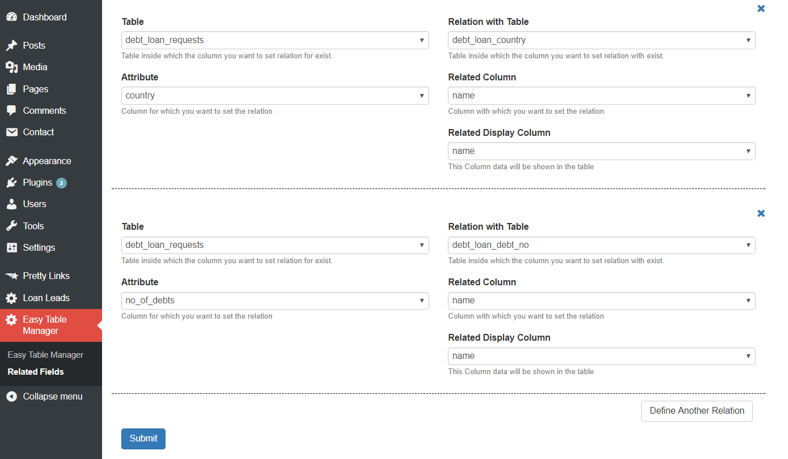
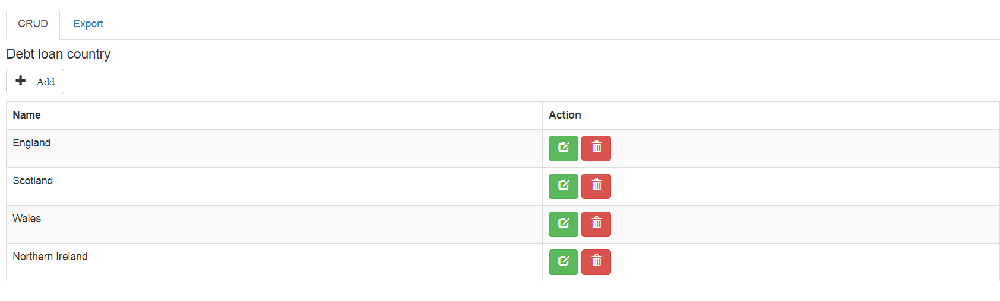

# Easy Table Manager

### Generate list, create, edit, delete (CRUD) for any table in seconds. 

### Highly customizable options allows privilege like 
* changing primary key for individual table, 
* ignoring files from crud, 
* change field label, 
* define checkbox and radio and image fields. 
* form validation
* shortcode for integrating table

###Integretion 
#### You can call the the shortcode with parameter anywhere.
```php

	$crud_param = array(
						'nonce' => 'easy-crud',
						'primary_key' => array('debt_loan_requests' => 'id'),
						'image_dir' => 'wp-content/images',
						'labels' => array('name' => 'NAME'), // array('column_name', 'changed_column_name')
						'ignore' => array('id', 'created_at', 'updated_at'),
						'optional_fields' => array('affordability_per_month'),
						'image_fields' => array('bank_logo', 'card_logo', 'commodity_logo', 'metal_logo'),
						'checkbox_fields' => array('test' => array('value' => 1)), // array('column_name' => array('value' => checkbox_value))
						'radio_fields' => array('is_featured' => array(1 => 'Yes', 0 => 'No')), // array('column_name' => array('radio_button_value' => 'radio button label', 'radio_button_value' => 'radio button label'))
					);
		$crud_param = addslashes(serialize($crud_param));
		do_shortcode("[smartCrud schema='table_name' params='".$crud_param."']");
```
#### or simply,
```php
	 do_shortcode("[smartCrud schema='table_name'");
```


### Define one to one relationship with another schema.


### Export to excel.
